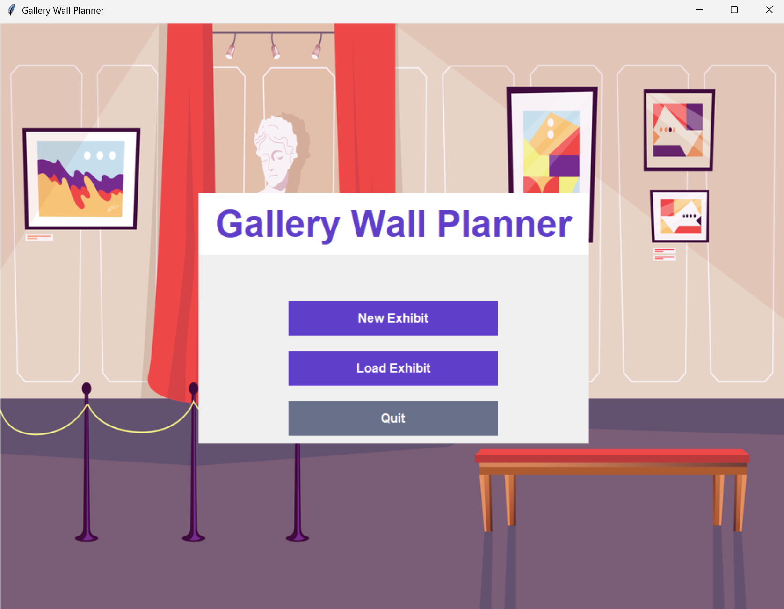

# Gallery Wall Planner Tool

 <!-- Add a screenshot if available -->

## Overview

The Gallery Wall Planner Tool is a Python-based application designed to simplify gallery art installation planning. It enables users to:
- Create virtual representations of gallery walls
- Manage artwork collections
- Visualize layouts before installation
- Generate precise hanging instructions

**Inspiration**: Developed from Yingxin's experience at Roberta's Art Gallery, addressing inefficiencies in traditional installation methods.

## Key Features

### 🖼️ Virtual Wall Visualization
- Create scaled wall representations
- Customize dimensions and colors
- Real-time rendering of wall space

### 🎨 Artwork Management
- Add artworks manually or via Excel import
- Track artwork details:
  - Dimensions (W×H×D)
  - Medium/Price/Notes
- Organized sidebar inventory

### ✋ Interactive Placement Tools
- Drag-and-drop interface
- Snap-to-grid functionality
- Collision detection

### 📐 Precision Tools
- **Snap Lines**: Create horizontal/vertical guides
- **Even Spacing**: Distribute artworks evenly between points
- **Permanent Objects**: Mark windows, doors, etc.

### 💾 Project Management
- Save/load wall layouts
- JSON export/import
- Installation instruction generation

## Installation

### Requirements
- Python 3.7+
- Tkinter (included with Python)
- Additional packages:
  ```bash
  pip install Pillow openpyxl